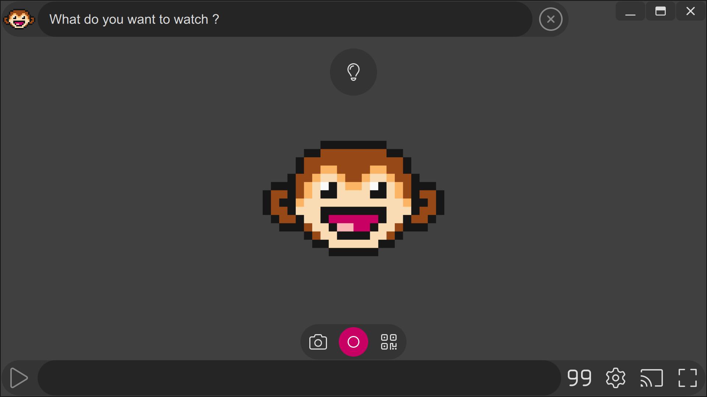

---

[MotionMonkey](https://omega.gg/MotionMonkey) is a [Semantic Player](https://omega.gg/about/SemanticPlayer). 
Designed to stream Internet videos from text queries. 
[omega](https://omega.gg/about) is building MotionMonkey to empower people. 

## MotionMonkey

MotionMonkey accesses videos directly via [DuckDuckGo](https://en.wikipedia.org/wiki/DuckDuckGo). 
It supports [BitTorrent](https://en.wikipedia.org/wiki/BitTorrent),
            [TMDB](https://www.themoviedb.org),
            [Youtube](https://en.wikipedia.org/wiki/Youtube),
            [Dailymotion](https://en.wikipedia.org/wiki/Dailymotion),
            [Vimeo](https://en.wikipedia.org/wiki/Vimeo),
            [Twitch](https://en.wikipedia.org/wiki/Twitch_(service)),
            [TikTok](https://en.wikipedia.org/wiki/TikTok),
            [Facebook](https://en.wikipedia.org/wiki/Facebook),
            [Odysee](https://en.wikipedia.org/wiki/Odysee),
            [Last.fm](https://en.wikipedia.org/wiki/Lastfm) and
            [SoundCloud](https://en.wikipedia.org/wiki/SoundCloud). 
All of this while serving the end user at all time and without ever showing an ad. 

## Technology

MotionMonkey is built in C++ with [Sky kit](https://omega.gg/Sky/sources). 

## Platforms

- Windows XP and later.
- macOS 64 bit.
- Linux 32 bit and 64 bit.
- iOS 64 bit.
- Android 32 bit and 64 bit.

## License

Copyright (C) 2015 - 2020 MotionMonkey authors | https://omega.gg/MotionMonkey

### Authors

- Benjamin Arnaud aka [bunjee](https://bunjee.me) | <bunjee@omega.gg>

### Private License Usage

MotionMonkey licensees holding valid private licenses may use this file in accordance with the private
license agreement provided with the Software or, alternatively, in accordance with the terms
contained in written agreement between you and MotionMonkey authors. For further information
contact us at contact@omega.gg.
